* 1.环境搭建
* 2.创建工程及工程目录介绍
* 3.dart代码
* 4.Flutter基础widget
* 5.Native通信与插件开发

##1.环境搭建
> * Flutter SDK
> * Flutter IDE

### 配置中国镜像
在搭建 Flutter 环境时，有可能被墙，需要先为 Flutter 配置中国镜像。

* Flutter社区

  FLUTTER_STORAGE_BASE_URL: https://storage.flutter-io.cn
  
  PUB_HOSTED_URL: https://pub.flutter-io.cn
  
* 上海交通大学 Linux 用户组
	
   FLUTTER_STORAGE_BASE_URL: https://mirrors.sjtug.sjtu.edu.cn
   
   PUB_HOSTED_URL: https://dart-pub.mirrors.sjtug.sjtu.edu.cn
   

MacOS上的配置方法
	
bash的在 ~/.bash_profile上添加如下环境变量:  
zsh的在～/.zshrc上添加如下环境变量:
 	
 	export PUB_HOSTED_URL=https://pub.flutter-io.cn
	export FLUTTER_STORAGE_BASE_URL=https://storage.flutter-io.cn
	
保存文件后，运行$ source ~/.bash_profile 或者$ source ～/.zshrc;

	
   
###获取Flutter SDK
1.下载[FlutterSDK](https://flutter.dev/docs/development/tools/sdk/releases?tab=macos#macos "title") 然后把下载的文件解压

2.添加环境变量
	
	export FLUTTER_HOME=SDK的下载目录
	export PATH=$PATH:$FLUTTER_HOME/bin
	source ~/.bash_profile
 
  上边的方法只在当前的Terminal生效，可以在对应的bash或者zsh配置文件中加入环境变量
  
3.FlutterSDK的四个版本（以下四个版本稳定性依次提高，但新特性却依次减少）

1. master
	
	master 分支上的代码是最新的，所以包含新的特性，但是 master 分支上的代码没有经过测试，很可能会出现各种各样的 bug。
	
2. dev

	Google 工程师会定期将 master 分支的代码滚动到 dev 分支上，在执行滚动的过程中，会对代码进行 Google 的内部测试，所以 dev 渠道是通过测试的最新的构建。但并不意味着 dev 版本不会有 bug，因为这个测试只是最基础的测试
	
3. beta
	
	beta 渠道的更新频率是一个月，每个月初，Flutter 团队会从前一个月左右的 dev 版本中选取最佳版本作为 beta 版发布，这个版本最起码在 dev 分支上使用一周的时间，且没有新的严重的 bug。
	
4. stable
	
	stable 渠道的更新频率是一个季度，每个季度发布一次或几次版本，但 stable 的发布频率是不确定的。stable 版本从 beta 分支中选出，只有当 Flutter 团队确定 beta 分支中有一个非常稳定非常好的构建时，而且通常 stable 版本的发布会在对外的公共活动中公布，例如 Flutter Live。
	
使用flutter channel可以切换版本
	
4.运行 flutter doctor

为了验证 Flutter 是否安装成功，运行：
   
	$ flutter doctor

输出如下说明安装完成并且没有错误

	➜  ~ flutter doctor
    Doctor summary (to see all details, run flutter doctor -v):
   
    [✓] Flutter (Channel stable, v1.9.1+hotfix.6, on Mac OS X 10.14.4 18E226, locale zh-Hans-CN)

    [✓] Android toolchain - develop for Android devices (Android SDK version 29.0.0)
    [✓] Xcode - develop for iOS and macOS (Xcode 11.1)
    [✓] Android Studio (version 3.4)
    [✓] VS Code (version 1.39.2)
    [✓] Connected device (1 available)

    • No issues found!

有错误的时候会有类似如下输出
  
    [!] Android toolchain - develop for Android devices (Android SDK 28.0.3)! Some Android licenses not accepted.  To resolve this, run: flutter doctor --android-licenses
    [!] iOS toolchain - develop for iOS devices (Xcode 10.1)
    ✗ Verify that all connected devices have been paired with this computer in Xcode.
      If all devices have been paired, libimobiledevice and ideviceinstaller may require updating.
      To update with Brew, run:
        brew update
        brew uninstall --ignore-dependencies libimobiledevice
        brew uninstall --ignore-dependencies usbmuxd
        brew install --HEAD usbmuxd
        brew unlink usbmuxd
        brew link usbmuxd
        brew install --HEAD libimobiledevice
        brew install ideviceinstaller
        
例如

[!] Android toolchain - develop for Android devices (Android SDK 28.0.3)! Some Android licenses not accepted.  To resolve this, run: flutter doctor --android-licenses

说明Android证书有问题 运行flutter doctor --android-licenses修复

###安装Flutter IDE

编辑器推荐使用Android Studio或者VS Code，需要安装对应的Flutter 插件。

1.Android Studio安装Flutter插件

1. Preferences -> Plugins 搜索Flutter点击安装
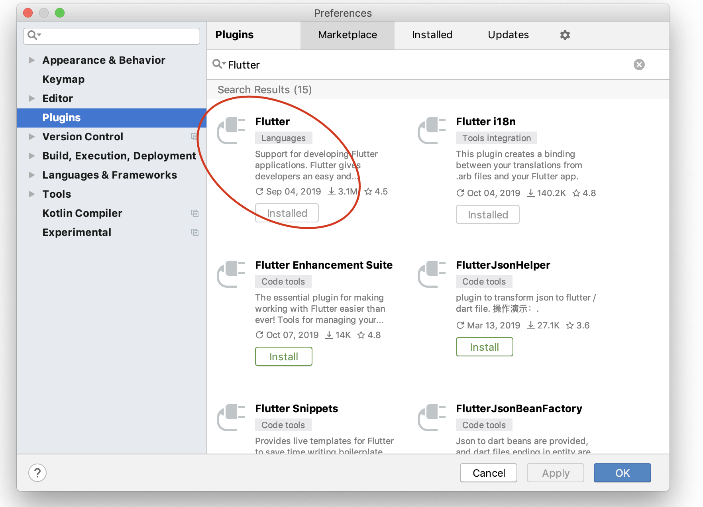

2. 安装完成后重启Android Studio

3. Android Studio 重启后，显示如下页面，说明 Flutter 插件已经安装完成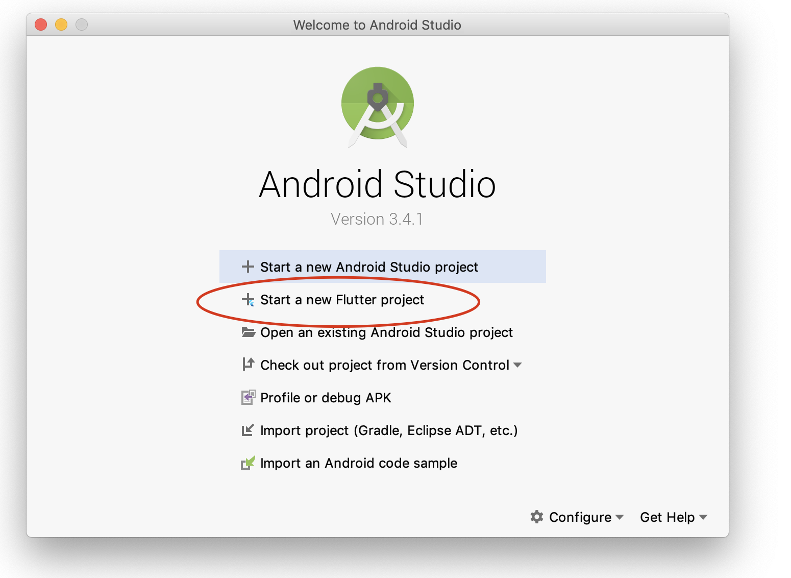

1.VS Code安装Flutter插件

1. 点击 View > Command Palette… 或者快捷键 Shift+cmd+P 输入install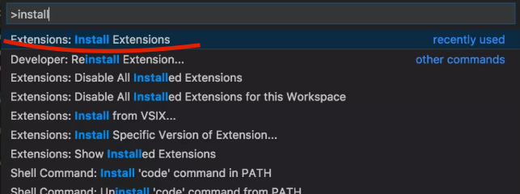

2. 在 Extensions 中搜索Flutter安装 
3. 安装完成后重启VS Code
4. 点击 View > Command Palette…，或者快捷键 Shift+cmd+P。输入 Flutter 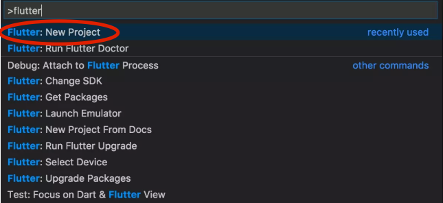

##2.创建工程及工程目录介绍

###flutter工程类型介绍

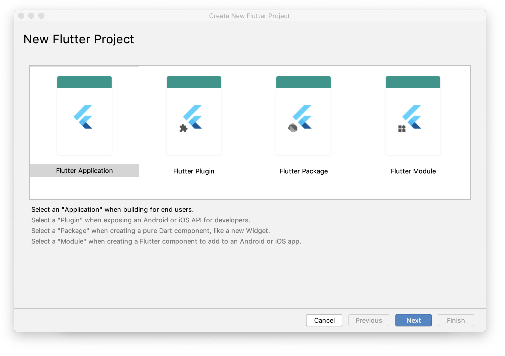

1. Flutter Application

	如果想让 Flutter 直接运行在 Android 或 iOS 上给用户使用，就用 Application 类型。
	
	    flutter create myapp

2. Flutter Plugin

	如果你想让 Flutter 调用 Android 或 iOS 的 API，并想将这个功能封装其起来供第三方使用，那么就用 Plugin 类型。 Plugin 是 Flutter 的一个插件包，例如，在 Android 上有播放音乐的功能，为了在 Flutter 中使用，就可以使用 Plugin 的模式：播放音乐的功能在 Android 上用 Java 实现，然后 Flutter 的代码通过 PlatformChannel 使用 Android 的播放音乐的功能，这就是一个完整的插件包，提供了播放音乐的功能。其他 Flutter APP 想要使用播放音乐的功能，就可以依赖这个插件包。 Flutter 想要使用 Android 或 iOS 的功能，都可以使用 Plugin 的模式。
	 
	    flutter create --org com.example --template=plugin -i objc -a java hello

3. Flutter Package

	Flutter Package 是纯 Dart 模块，只能实现 Flutter 的相关功能，例如实现一个 Widget，然后给第三方使用。
	
	    flutter create --template=package hello
4. Flutter Module

	如果要将 Flutter 添加到 Android APP 或 iOS APP 中，实现 Flutter 和 Native 的混合开发，就使用 Module 类型。

	Flutter 的混合开发模式就采用的这种类型，在 Android 上打包成 aar，在 iOS 上打包成 Framework，可以很方便的集成进原有的 Native 工程里，实现 Flutter 和 Native 的混合开发。
	
	    flutter create --template=module hello

#####Plugin 和 Package
  >Flutter 的 Plugin 和 Package 可以用于组件化开发。

  >可以在 pub.dartlang.org/ 网站上看到所有的 Flutter 库。

  >或者在国内镜像 pub.flutter-io.cn/ 上查看 Flutter 库
  
###flutter工程目录

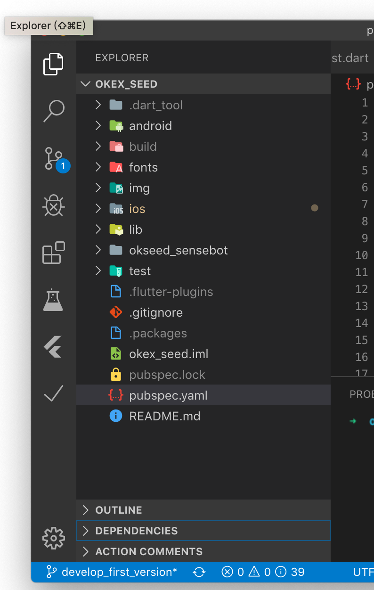

* android 目录

	这个目录下是一个完整的 Android APP 工程的代码。可以理解成 Flutter 在 Android 上的壳子。这个目录里的代码都会被打包进 Flutter 的 Android 安装包里。
	
* ios 目录

	这个目录下是一个完整的 iOS APP 工程的代码。可以理解成 Flutter 在 iOS 上的壳子。这个目录里的代码都会被打包进 Flutter 的 iOS 安装包里。

* lib 目录

	这里是 我们自己编写的 Flutter 的dart代码。main.dart 是 Flutter 的入口文件。

* okseed_sensebot
	
	这个是自己开发的flutter插件
	
* test 目录

	这里是 Flutter 的测试代码，可以编写一些测试用例。
	
* pubspec.yaml 文件

 	这个是 Flutter 的配置文件，是[**Flutter里的重要部分**](#markdown)。声明了 Flutter APP 的名称、版本、作者等的元数据文件，还有声明的依赖库，和指定的本地资源（图片、字体、音频、视频等）。

###pubspec.yaml 介绍

pubspec.yaml 是 Flutter 工程的配置文件，使用 YAML 语言。
		
	name: flutter_doubanmovie
	description: A new Flutter project.

	version: 1.0.0

	authors:
	- Lei wang <some@google.com>
	- xixi <some@google.com>

	homepage: https://flutter.dev/

	environment:
  		sdk: ">=2.1.0 <3.0.0"

	dependencies:
  		flutter:
    		sdk: flutter

  		cupertino_icons: ^0.1.2
  		http: ^0.12.0+2
  		shared_preferences: ^0.5.2

	dev_dependencies:
  		flutter_test:
    		sdk: flutter

	flutter:
  		uses-material-design: true

#####pubspec.yaml 支持的字段

字段名	         		| 含义            | 可选/必选  |
--------------------|--------------- |-----------|
name					| 工程名字	   	    | 必选   |
description       	| 工程的描述	    | 想要发布到 Pub 上，就是必选   |
version  	        	| 工程的版本号	      | 想要发布到 Pub 上，就是必选        |
author or authors 	| 作者名字	       | 可选  |
homepage           	|  主页    		| 可选 |
environment         | 指定 Dart 的版本| 可选   |
repository          | 指向工程的源代码的地址      | 可选     |
issue_tracker       | 指向跟踪工程issue的地址 |可选    |
documentation       | 指向工程文档的地址 |可选    |
dependencies        | 依赖的开发库	 |可选    |
executables         | 用于将包的可执行文件放在PATH上：可以将其一个或多个脚本公开为可以直接从命令行运行的可执行文件    |可选 |
publish_to      	   | 指定发布包的位置，默认是 Pub |可选    |
flutter         	   | flutter 资源相关的配置，包括图片、字体等 |必选   |

##dart语法

[http://dart.goodev.org/guides/language/language-tour](http://dart.goodev.org/guides/language/language-tour)

##Widget介绍

Flutter中的Widget相当于Android里的View，iOS里的UIView。Flutter通过Widget渲染页面，但不仅于此。
除了 UI、布局之外，还有交互、动画等。

Flutter官网上将Widget分为14类，总共有上百个Widget

1. Accessibility
2. Animation and Motion
3. Assets, Images, and Icons
4. Async
5. Basics
6. Cupertino (iOS-style widgets)
7. Input
8. Interaction Models
9. Layout
10. Material Components
11. Painting and effects
12. Scrolling
13. Styling
14. Text

程序里Widget以树形结构组合，父Widget包含子Widget。

####根Widget
需要特别注意的 main.dart中返回的Widget一般是Flutter提供的以下三种：

* WidgetsApp 是可以自定义风格的 根Widget。

* MaterialApp 是在 WidgetsApp 上添加了很多 material-design 的功能，是 Material Design 风格的根Widget。功能完善，推荐使用。

* CupertinoApp 也是基于WidgetsApp实现的 iOS 风格的 根Widget。

#####MaterialApp的各字段：

字段名	         		| 含义            |类型
--------------------|--------------- |--------------
navigatorKey			| 导航键（可以实现无context跳转）| GlobalKey<NavigatorState>
onGenerateRoute     | 当通过Navigation.of(context).pushNamed跳转路由时，在routes查找不到时，会调用该方法	       | RouteFactory（生成路由的方法）
onUnknownRoute  	    | 效果跟onGenerateRoute一样调用顺序为onGenerateRoute ==> onUnknownRoute	       | RouteFactory
navigatorObservers 	| 导航观察器（当调用Navigator的相关方法时，会回调相关的操作）	   | List\<NavigatorObserver>
initialRoute        |  初始路由（当程序进入时自动跳转到路由，此路由必须在home的下级）       | String
title          		| 标题 （Android：任务管理器的程序快照之上；IOS: 程序切换管理器中）  			| String
onGenerateTitle     | 生成标题（跟上面的tiitle一样，但含有一个context参数，可做一些定制化，比如本地化）  		| GenerateAppTitle
color       			| Android中程序切换中应用图标背景的颜色，当应用图标背景为透明时 | Color
locale        		| 本地化位置 	 	| Locale
localizationsDelegates | 本地化委托    | Iterable\<LocalizationsDelegate\<dynamic>>
localeResolutionCallback | 区域变化回调 | LocaleResolutionCallback
supportedLocales   | 支持的区域 | Iterable<Locale>
showPerformanceOverlay   | 显示性能 | bool
checkerboardRasterCacheImages   | 棋盘格光栅缓存图像 | bool
checkerboardOffscreenLayers   | 棋盘格层 | bool
showSemanticsDebugger   | 类似Android开发者模式中显示布局边界 | bool
debugShowCheckedModeBanner   | 显示调试检查模式横幅 | bool
home   | 主页 | Widget
routes   | 路由 | Map<String, WidgetBuilder>
theme   | 主题 | ThemeData
debugShowMaterialGrid   | 显示调试网格 | bool

#####MaterialApp一般配合Scaffold使用，Scaffold 是实现 Material Design 基本视觉布局结构的 Widget,它被设计为 MaterialApp 的顶级容器，会自动填满屏幕，而且会自动适配不同的屏幕，例如刘海屏等，
以下下是Scaffold的属性：

字段名	         		| 含义            |类型
--------------------|--------------- |--------------
appBar			| 界面顶部的一个导航栏 AppBar功能丰富，基本能满足导航栏的各种布局需求| AppBar
body          | appBar下边的布局区域	          | Widget
floatingActionButton  | 一个悬浮按钮，类似 Android 的 FloatingActionButton 控件  | FloatingActionButton
persistentFooterButtons 	| 固定在下方显示的按钮，比如对话框下方的确定、取消按钮| persistentFooterButtons

####StatelessWidget 和 StatefulWidget
根据UI是否有变化，将Widget分为StatelessWidget和StatefulWidget

###StatefulWidget

StatefulWidget可以根据state的状态来改变UI显示（见[**statefulwidget_demo**]()）

		class MyApp extends StatefulWidget {
  		// This widget is the root of your application.

		  @override
		  State<StatefulWidget> createState() {
		    // TODO: implement createState
		    return MyAppState("Hello World");
		  }
		}

		class MyAppState extends State<MyApp> {
		
		  @override
		  Widget build(BuildContext context) {
		    return ...
		  }
		 
		}

###StatefulWidget的必要实现步骤：

1. 首先继承 StatefulWidget
2. 实现 createState() 的方法，返回一个 State

###State 的实现步骤：

1. 首先继承 State，State 的泛型类型是上面定义的 Widget 的类型
2. 实现 build() 的方法，返回一个 Widget
3. 需要更改数据，刷新 UI 的话，调用 setState()

一个功能是创建Widget显示页面，一个是管理状态通过setState()方法刷新UI

###State 里面有三个重要的成员变量：

1. widget
2. content
3. mounted

####1.widget
		child: Text(_content, style: new TextStyle(color: this.widget.textColor)),

####2.context

####3. mounted
mounted 是 bool 类型，表示当前 State 是否加载到树里。State 对象创建之后，initState() 创建之前，framework 通过与 BuildContext 相关联，来将State对象加载到树中，此时 mounted 会变为 true，当 State dispose 之后,mounted 就变为 false。

setState() 只有在 mounted 为 true 的时候才能用，当 moundted 为 false 时调用会抛异常。

###StatefulWidget 的生命周期 （见[**statefulwidget_demo**]()）

StatefulWidget 由 StatefulWidget 和 State 两部分组成，所以也有 StatefulWidget 的生命周期和 State 生命周期。

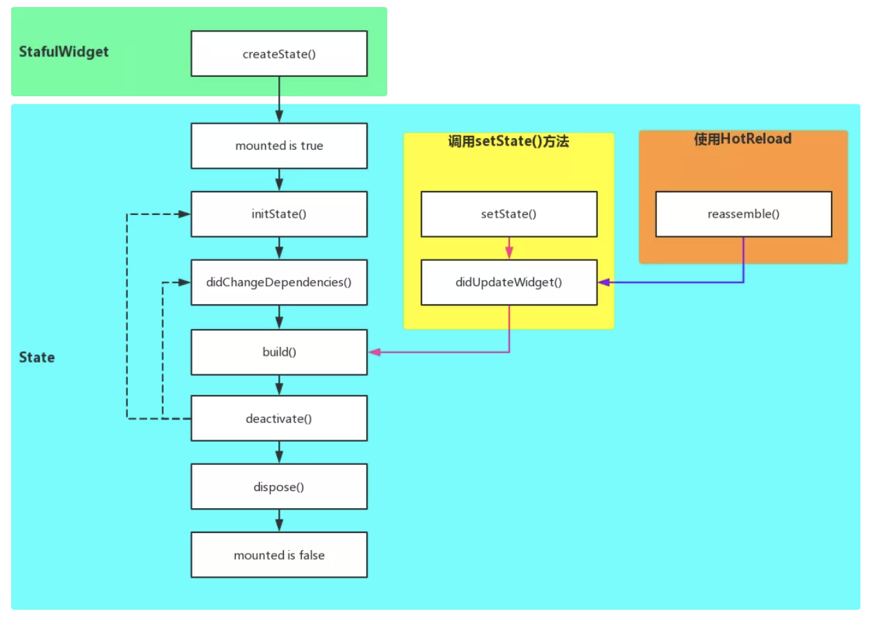

####StatefulWidget的生命周期

* createState （createState函数）

####State 的生命周期

* moundted is true

	mounted 是 boolean，只有当mounted 为 true 时，才能使用 setState()。
	
* initState

	initState() 方法是在创建 State 对象后要调用的第一个方法（在构造函数之后）。
	
	可以在这里执行其的他初始化, animations、 controllers 等动画相关的初始化。
	
	重写此方法，需要首先调用 super.initState() 方法。
	
* didChangeDependencies

	initState() 方法运行完后，就立即运行 didChangeDependencies() 方法。
	
	当 Widget 依赖的数据被调用时，此方法也会被调用。
	
	重写此方法，则应首先调用 super.didChangeDependencies（）。

* build

	build() 方法在 didChangeDependencies()（或者 didUpdateWidget() ）之后调用。 这是构建Widget的地方。

	每次 State 对象更改时（或者当 InheritedWidget 需要通知“已注册”的小部件时）都会调用此方法！
	
	调用 setState() 方法时，会跳用build() 方法
	
	至此，一个 Widget 从创建到显示的声明周期就完成了
	
* setState()

	当状态有变化，需要刷新UI的时候，就调用 setState()，会触发 didUpdateWidget() --> build()，强制重建 Widget。
	
* didUpdateWidget()

	在 didUpdateWidget() 里，会把新的 Widget 的配置赋值给 State，相当于重新 initState() 了一次。

* deactive
	
	当 State 从树中移除时，就会触发 deactive
	
* dispose

	当 StaefulWidget 从树中移除时调用 dispose() 方法。
	可以在这里执行一些清理逻辑（例如动画监听器），重写此方法时，需要首先调用 super.dispose()。

* mounted is false

   至此widget销毁
   

###StatelessWidget

StatelessWidget 是没有 State（状态）的 Widget，当 Widget 在运行时不需要改变时，就用 StatelessWidget。

####StatelessWidget 的实现（见[**statelesswidget_demo**]()）

	class StatelessDemo extends StatelessWidget {

	  @override
	  Widget build(BuildContext context) {
	    return Container(
	      child: child,
	    );
	  }
	}
1. 首先继承 StatelessWidget。

2. 必须要实现 build 函数，返回一个 Widget。

####StatelessWidget 使用注意事项

如果你想要为 StatelessWidget 赋值，只能在 StatelessWidget 初始化的时候，通过构造函数传递一些额外的参数。但是请记住，这些参数不会在以后阶段发生变化，即使发生变化，也只能按原值使用。因为 StatelessWidget 只会渲染一次。

当StatefulWidget包含StatelessWidget的子节点时（见[**statelesswidget_demo**]()），StatelessWidget使用了父节点的state状态来显示，当父节点调用setState，会引起子节点的重建。

StatefulWidget和StatelessWidget 的区别归纳为能不能发生变化不太恰当。应该归纳为有没有管理状态的能力。

##常用widget介绍

官方提供的widgets有上百个，我们介绍一些基础的常用的，通过对这些常用的widget的了解，熟悉widget的使用方法和代码风格，基本可以完成页面的布局。然后其他的widget到用的时候可以自己查看与理解。

###Text文本（见[**text_demo**]()）

		Text(
            '大家好 hello flutter hello flutter hello flutter hello flutter hello flutter',
            style: new TextStyle(
              inherit: true,//为空值的时候，是否从祖先文本继承样式。（一般用在[TextSpan]树中）
              color: Colors.red,// 颜色
              fontSize: 20,//大小
              fontWeight: FontWeight.w700, //子重
              fontStyle: FontStyle.italic, //斜体
              letterSpacing: 10, //字间距 每个字（字母）
              wordSpacing: 20, //词间距
              textBaseline: TextBaseline.ideographic, // 基线，两个值，用来排字母的，用来排表意字的（类似中文）
              height: 2,//行高 (比例值， 2就是2倍行高)
              // foreground: new Paint()..color = Colors.blueGrey,
              //与color的功能一样，多个文本时，缓存此Paint对象可以提高性能
              //注意：foreground和color不能同时使用
              // background: new Paint()..color = Colors.brown[300], //文本的背景画笔
              // shadows: [
              //   new Shadow(color: Color(0xFFFF0000), offset: Offset(2, 2), blurRadius: 1),
              //   new Shadow(color: Color(0xFF00FF00), offset: Offset(6, 6), blurRadius: 1)
              // ],//文本阴影
              decoration: TextDecoration.underline, //下划线  overline 上划线  lineThrough 中划线
              decorationStyle: TextDecorationStyle.double, //TextDecorationStyle.solid：实线;
              //TextDecorationStyle.double：两条线;
              //TextDecorationStyle.dotted：点虚线;
              //TextDecorationStyle.dashed：间隔虚线（比点要长）;
              //TextDecorationStyle.wave：波浪线
              //注意：一般情况下颜色与color一样 如果设置了foreground 则下划线的颜色与background一样
              //fontFamily: //指定字体
              //fontFamilyFallback: //字体列表，当前面的字体找不到时，会在这个列表里依次查找
            ),
            textAlign: TextAlign.center,
            textDirection: TextDirection.ltr,
            softWrap: false,// 是否支持换行， false只有一行
            overflow: TextOverflow.ellipsis,//文本截断方式
            //TextOverflow.clip 在父节点区域内直接截断
            //TextOverflow.fade 末尾变透明
            //TextOverflow.ellipsis 末尾显示...
            //TextOverflow.visible  可以超出父节点，屏幕内截断
            textScaleFactor: 1.0, //缩放因子，字体大小随系统设置的大小变化，设置此值避免跟随系统设置的大小变化
            maxLines: 10, //最大行数
          )

###RichText（见[**text_demo**]()）

			RichText(
              text: TextSpan(
                children: [
                  TextSpan(
                    text: "Hello",
                    style: TextStyle(color: Colors.blue,fontSize: 20),
                    recognizer: TapGestureRecognizer()..onTap = () {
                      debugPrint('Hello');
                    },
                  ),
                  TextSpan(
                    text: "Flutter",
                    style: TextStyle(color: Colors.red,fontSize: 20),
                    recognizer: TapGestureRecognizer()..onTap = () {
                      debugPrint('Flutter');
                    },
                  ),
                ],
              ),
            )

###image （见[**image_demo**]()）

#####使用本地图片资源
1.  创建一个存储images的目录

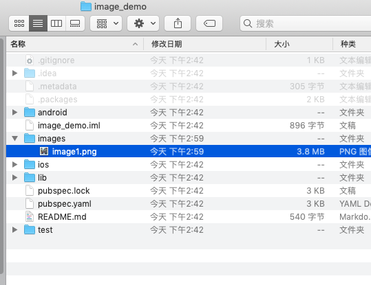

2.  打开 pubspec.yml ,在 flutter 中添加图片的配置信息： 

		flutter:    
 		 	assets:
    		- images/image1.png
    		- images/image2.png

	或者

		flutter:    
 		 	assets:
    		 - images/

3.  使用的时候，需要传入图片的路径：
 		
 		Image.asset("images/image1.png"),

	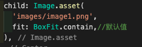

Image 总共有 5 个构造函数，除了默认的构造函数，还有四种命名构造函数：

	class Image extends StatefulWidget {
	
	    const Image({
	        @required this.image,
	        ...
	    })
	    //加载网络图片
	    Image.network(String src,{
	        ...
	    })
	    //加载本地图片，这里需要传入图片的本地地址
	    Image.file(File file, {
	        ...
	    })
	    //APP的资源文件里加载显示图片
	    Image.asset(String name, {
	        ...
	    })
	    //从内存加载显示图片， 这里需要传入图片的bytes数据，类型是Uint8List
	    Image.memory(Uint8List bytes, {
	        ...
	    })

	}

这些构造函数有一些共同的参数，来控制图片的拉伸，对齐，宽高，颜色过滤等：

字段名	         		| 类型           |含义 
--------------------|--------------- |--------------
scale	|double	|图形显示的比例	
width	|double	|图片的宽如果为null的话，则图像将选择最佳大小显示，而且会保留其固有宽高比的大小
height	|double	|图片的高如果为null的话，则图像将选择最佳大小显示，而且会保留其固有宽高比的大小
color	|Color|	图片的混合色值	
colorBlendMode|	BlendMode	|图片与颜色的混合模式
fit |	BoxFit |	用于在图片的显示空间和图片本身大小不同时指定图片的适应模式
alignment|	Alignment	|图片的对齐方式	
repeat|	ImageRepeat	|当图片本身大小小于显示空间时，指定图片的重复规则
centerSlice|	Rect	|在这个矩形范围内的图片会被当成.9的图片
matchTextDirection|	bool	|图片的绘制方向 true:从左往右  false:从右往左
gaplessPlayback	|bool	|当图像提供者更改时 true：继续显示旧图像 false：简单地显示任何内容
filterQuality	|FilterQuality	|设置图片的过滤质量

###布局Widgets

布局Widget 按照可以包含的 子Widget 的数量分为：[**单子节点**]()与[**多子节点**]()

* 单子Widget布局：就是布局 Widget 只能含有一个 子Widget的

	有 Container、Padding、Align、Center、FittedBox、AspectRatio、ConstrainedBox、Baseline、FractionallySizedBox、IntrinsicHeight、IntrinsicWidth、LimitedBox、Offstage、OverflowBox、SizedBox、SizedOverflowBox、Transform、CustomSingleChildLayout。
	
		Center(
          child: Image.asset(
            'images/image1.png',
          ),
        ),
	

* 多子Widget布局：就是布局 Widget 可以含有 多个子Widget的

 	例如Row， Column, GridView, ListView,Flow、Wrap、Stack、IndexedStack、ListBody、CustomMultiChildLayout
 	
 		Column(
		    children: <Widget>[
		        Text(content),
		        Text(content),
		        ...
		   	]
		)

单节点的子节点属性是child；多节点的子节点的属性是children。

###Container详解

Flutter中最常见的布局widget。官方给出的简介，是一个结合了绘制（painting）、定位（positioning）以及尺寸（sizing）widget的widget。

####Container的组成：
 
* 最里层的是child元素；
* child元素首先会被padding包着；
* 然后添加额外的constraints限制；
* 最后添加margin。

####Container的绘制的过程：

* 首先会绘制transform效果；
* 接着绘制decoration；
* 然后绘制child；
* 最后绘制foregroundDecoration。

####Container自身尺寸的调节分两种情况：

1. Container在没有子节点（children）的时候，会试图去变得足够大。除非constraints是unbounded限制，在这种情况下，Container会试图去变得足够小。
2. 带子节点的Container，会根据子节点尺寸调节自身尺寸，但是Container构造器中如果包含了width、height以及constraints，则会按照构造器中的参数来进行尺寸的调节。

####Container的布局行为

由于Container组合了一系列的widget，这些widget都有自己的布局行为，因此Container的布局行为有时候是比较复杂的。

一般情况下，Container会遵循如下顺序去尝试布局：

* 对齐（alignment）；
* 调节自身尺寸适合子节点；
* 采用width、height以及constraints布局；
* 扩展自身去适应父节点；
* 调节自身到足够小。

进一步说：

* 如果没有子节点、没有设置width、height以及constraints，并且父节点没有设置unbounded的限制，Container会将自身调整到足够小。
* 如果没有子节点、对齐方式（alignment），但是提供了width、height或者constraints，那么Container会根据自身以及父节点的限制，将自身调节到足够小。
* 如果没有子节点、width、height、constraints以及alignment，但是父节点提供了bounded限制，那么Container会按照父节点的限制，将自身调整到足够大。
* 如果有alignment，父节点提供了unbounded限制，那么Container将会调节自身尺寸来包住child；
* 如果有alignment，并且父节点提供了bounded限制，那么Container会将自身调整的足够大（在父节点的范围内），然后将child根据alignment调整位置；
* 含有child，但是没有width、height、constraints以及alignment，Container会将父节点的constraints传递给child，并且根据child调整自身

####Container的属性

Container的构造函数如下：
		
	Container({
	    Key key,
	    this.alignment,
	    this.padding,
	    Color color,
	    Decoration decoration,
	    this.foregroundDecoration,
	    double width,
	    double height,
	    BoxConstraints constraints,
	    this.margin,
	    this.transform,
	    this.child,
  	})

字段名	         		| 含义 
--------------------|--------------
key | widget的唯一标志符
alignment | 控制child的对齐方式，如果container或者container父节点尺寸大于child的尺寸，这个属性设置会起作用，有很多种对齐方式。
padding | decoration内部的空白区域，如果有child的话，child位于padding内部。padding与margin的不同之处在于，padding是包含在content内，而margin则是外部边界，设置点击事件的话，padding区域会响应，而margin区域不会响应。
color | 用来设置container背景色，如果foregroundDecoration设置的话，可能会遮盖color效果。
decoration | 绘制在child后面的装饰，设置了decoration的话，就不能设置color属性，否则会报错，此时应该在decoration中进行颜色的设置。
foregroundDecoration | 绘制在child前面的装饰。
width | container的宽度，设置为double.infinity可以强制在宽度上撑满，不设置，则根据child和父节点两者一起布局。
height | container的高度，设置为double.infinity可以强制在高度上撑满。
constraints | 添加到child上额外的约束条件。
margin | 围绕在decoration和child之外的空白区域，不属于内容区域。
transform | 设置container的变换矩阵，类型为Matrix4。
child | container中的内容widget。 

####例子（见[**layout_demo**]()）

	Container(
        constraints: new BoxConstraints.expand(
          height:200.0,
        ),
        decoration: new BoxDecoration(
          border: new Border.all(width: 2.0, color: Colors.red),
          color: Colors.grey,
          borderRadius: new BorderRadius.all(new Radius.circular(20.0)),
          image: new DecorationImage(
            image: new NetworkImage('http://h.hiphotos.baidu.com/zhidao/wh%3D450%2C600/sign=0d023672312ac65c67506e77cec29e27/9f2f070828381f30dea167bbad014c086e06f06c.jpg'),
            centerSlice: new Rect.fromLTRB(270.0, 180.0, 1360.0, 730.0),
          ),
        ),
        padding: const EdgeInsets.all(8.0),
        alignment: Alignment.center,
        child: new Text('Hello World',
          style: Theme.of(context).textTheme.display1.copyWith(color: Colors.black)),
        transform: new Matrix4.rotationZ(0.3),
     ),

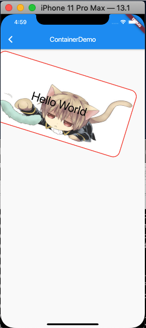

###Padding详解（见[**layout_demo**]()）

单节点控件，功能是 给子节点设置padding属性。

Padding的布局分为两种情况：

* 当child为空的时候，会产生一个宽为left+right，高为top+bottom的区域；
* 当child不为空的时候，Padding会将布局约束传递给child，根据设置的padding属性，缩小child的布局尺寸。然后Padding将自己调整到child设置了padding属性的尺寸，在child周围创建空白区域。

官方例子：
		
	new Padding(
        padding: new EdgeInsets.all(28.0),
        child: const Card(child: const Text('Hello World!')),
    )

###Align

设置child的对齐方式，例如居中、居左居右等，并根据child尺寸调节自身尺寸

布局行为

* 当widthFactor和heightFactor为null的时候，当其有限制条件的时候，Align会根据限制条件尽量的扩展自己的尺寸，当没有限制条件的时候，会调整到child的尺寸；
* 当widthFactor或者heightFactor不为null的时候，Aligin会根据factor属性，扩展自己的尺寸，例如设置widthFactor为2.0的时候，那么，Align的宽度将会是child的两倍。

官方例子：
		
	new Align(
  		alignment: Alignment.center,
  		widthFactor: 2.0,
  		heightFactor: 2.0,
 		child: new Text("Align"),
	)

#####推荐一篇文章 [出神入化的Align](https://juejin.im/post/5d89967ee51d453b1e478b9a)

###Center 
Center继承自Align，只不过是将alignment设置为Alignment.center

###AspectRatio（见[**layout_demo**]()）

AspectRatio的作用是调整child到设置的宽高比

#####布局行为
* AspectRatio首先会在布局限制条件允许的范围内尽可能的扩展，widget的高度是由宽度和比率决定的，类似于BoxFit中的contain，按照固定比率去尽量占满区域。
* 如果在满足所有限制条件过后无法找到一个可行的尺寸，AspectRatio最终将会去优先适应布局限制条件，而忽略所设置的比率。

#####示例代码

	new Container(
	  height: 200.0,
	  child: new AspectRatio(
	    aspectRatio: 1.5, //宽高比
	    child: new Container(
	      color: Colors.red,
	    ),
	  ),
	);
	
子控件会按照设置的宽高比显示大小

###ConstrainedBox（见[**layout_demo**]()）

这个控件的作用是添加额外的限制条件（constraints）到child上

#####示例代码

	new ConstrainedBox(
	  constraints: const BoxConstraints(
	    minWidth: 100.0,
	    minHeight: 100.0,
	    maxWidth: 150.0,
	    maxHeight: 150.0,
	  ),
	  child: new Container(
	    width: 20.0,
	    height: 20.0,
	    color: Colors.red,
	  ),
	);

在一个宽高为20的Container上加上 minWidth，minHeight为100的ConstrainedBox，这个Container的实际宽高是100。

###Offstage（见[**layout_demo**]()）

Offstage的作用很简单，通过一个参数，来控制child是否显示，日常使用中也算是比较常用的控件。

#####布局行为

* 当offstage为true，当前控件不会被绘制在屏幕上，不会响应点击事件，也不会占用空间；
* 当offstage为false，当前控件则跟平常用的控件一样渲染绘制；

另外，当Offstage不可见的时候，如果child有动画，应该手动停掉，Offstage并不会停掉动画。

#####示例代码（见[**layout_demo**]()）

	Column(
	  children: <Widget>[
	    new Offstage(
	      offstage: offstage,
	      child: Container(color: Colors.blue, height: 100.0),
	    ),
	    new CupertinoButton(
	      child: Text("点击切换显示"),
	      onPressed: () {
	        setState(() {
	          offstage = !offstage;
	        });
	      },
	    ),
	  ],
	)
当点击切换按钮的时候，可以看到Offstage显示消失。

###SizedBox

比较常用的一个控件，设置具体尺寸。

#####布局行为:

* child不为null时，如果设置了宽高，则会强制把child尺寸调到此宽高；如果没有设置宽高，则会根据child尺寸进行调整；
* child为null时，如果设置了宽高，则自身尺寸调整到此宽高值，如果没设置，则尺寸为0；

#####示例代码:

	Container(
	  color: Colors.green,
	  padding: const EdgeInsets.all(5.0),
	  child: SizedBox(
	    width: 200.0,
	    height: 200.0,
	    child: Container(
	      color: Colors.red,
	      width: 100.0,
	      height: 300.0,
	    ),
	  ),
	)

这个控件，很多场景可以使用。但是，可以替代它的控件也有不少，例如Container、ConstrainedBox等。而且SizedBox就是ConstrainedBox的一个特例。

###Row 与 Column（见[**layout_demo**]()）

在Flutter中非常常见的一个多子节点控件，将children排列成一行。估计是借鉴了Web中Flex布局，所以很多属性和表现，都跟其相似。但是注意一点，自身不带滚动属性，如果超出了一行，在debug下面则会显示溢出的提示。

#####布局行为:
Row的布局有六个步骤，这种布局表现来自Flex（Row和Column的父类）：

1. 首先按照不受限制的主轴（main axis）约束条件，对flex为null或者为0的child进行布局，然后按照交叉轴（cross axis）的约束，对child进行调整；
2. 按照不为空的flex值，将主轴方向上剩余的空间分成相应的几等分；
3. 对上述步骤flex值不为空的child，在交叉轴方向进行调整，在主轴方向使用最大约束条件，让其占满步骤2所分得的空间；
4. Flex交叉轴的范围取自子节点的最大交叉轴；
5. 主轴Flex的值是由mainAxisSize属性决定的，其中MainAxisSize可以取max、min以及具体的value值；
6. 每一个child的位置是由mainAxisAlignment以及crossAxisAlignment所决定。

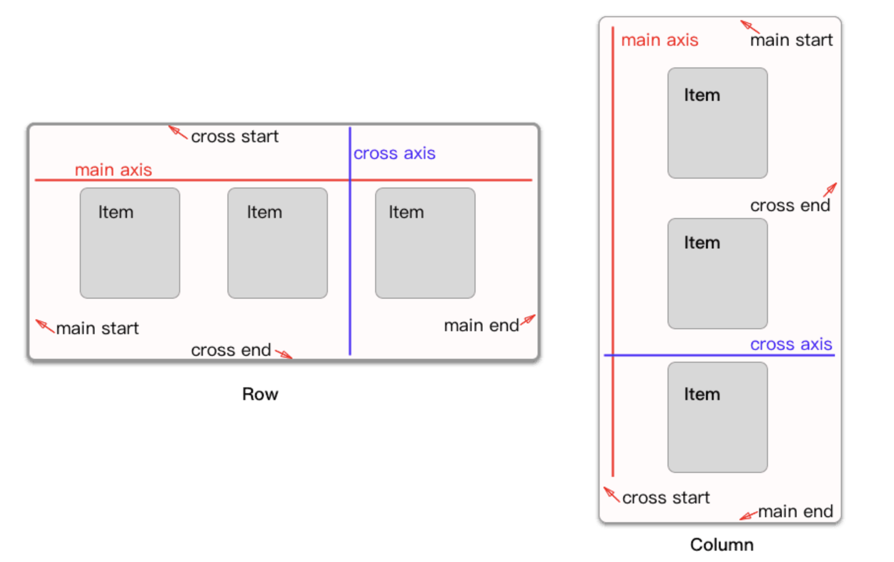

#####示例代码:

	Row(
      children: <Widget>[
        SizedBox(width: 15,),
        Column(
          mainAxisAlignment: MainAxisAlignment.center,
          crossAxisAlignment:CrossAxisAlignment.start,
          children: <Widget>[
            Row(
              crossAxisAlignment: CrossAxisAlignment.end,
              children: <Widget>[
                Text('BTC',textScaleFactor:1, style: new TextStyle(color: Color(0xFF121929), fontSize: 18)),
                Text(' / usdt', textScaleFactor:1,style: new TextStyle(color: Color(0xFF9EA6B6), fontSize: 12)),
              ],
            ),
            Text('99999',textScaleFactor:1, style: new TextStyle(color: Color(0xFF9EA6B6), fontSize: 12)),
          ],
        ),
        Expanded(child: Container(),),
        Column(
          mainAxisAlignment:MainAxisAlignment.center,
          crossAxisAlignment:CrossAxisAlignment.end,
          children: <Widget>[
            Text('88888',textScaleFactor:1,style: new TextStyle(color: Color(0xFF121929), fontSize: 18, fontWeight: FontWeight.w500)),
            Text('66666',textScaleFactor:1, style: new TextStyle(color: Color(0xFF9EA6B6), fontSize: 12, fontWeight: FontWeight.w500))
          ],
        ),
        SizedBox(width: 20,),
        SizedBox(
          width: 80,
          child: Container(
            width: 80,
            height: 30,
            decoration: BoxDecoration(
                color: Colors.red,
                borderRadius: new BorderRadius.all(Radius.circular(3)),
            ),
            child: Center(
              child: Text(
                '+20%',
                textScaleFactor:1,
                style: new TextStyle(
                  color: Colors.white,
                  fontSize: 14,
                  fontWeight: FontWeight.w500
                ),
              ),
            )
          ),
        ),
        SizedBox(width: 15,),
      ],
    ),

#####属性解析
字段名	         		| 含义 
--------------------|--------------
MainAxisAlignment|主轴方向上的对齐方式，会对child的位置起作用，默认是start。

其中MainAxisAlignment枚举值：

start：将children放置在主轴的起点；

center：将children放置在主轴的中心；

end：将children放置在主轴的末尾；

spaceAround：将主轴方向上的空白区域均分，使得children之间的空白区域相等，但是首尾child的空白区域为1/2；

spaceBetween：将主轴方向上的空白区域均分，使得children之间的空白区域相等，首尾child都靠近首尾，没有间隙；

spaceEvenly：将主轴方向上的空白区域均分，使得children之间的空白区域相等，包括首尾child；

其中spaceAround、spaceBetween以及spaceEvenly的区别，就是对待首尾child的方式。其距离首尾的距离分别是空白区域的1/2、0、1。

字段名	         		| 含义 
--------------------|--------------
MainAxisSize | 在主轴方向占有空间的值，默认是max。

MainAxisSize的取值有两种：

max：根据传入的布局约束条件，最大化主轴方向的可用空间；

min：与max相反，是最小化主轴方向的可用空间；

字段名	         		| 含义 
--------------------|--------------
CrossAxisAlignment|children在交叉轴方向的对齐方式，与MainAxisAlignment略有不同。

CrossAxisAlignment枚举值有如下几种：

baseline：在交叉轴方向，使得children的baseline对齐；

center：children在交叉轴上居中展示；

end：children在交叉轴上末尾展示；

start：children在交叉轴上起点处展示；

stretch：让children填满交叉轴方向；

字段名	         		| 含义 
--------------------|--------------
TextBaseline|使用的TextBaseline的方式
TextDirection | 阿拉伯语系的兼容设置，一般无需处理。
VerticalDirection|定义了children摆放顺序，默认是down。

VerticalDirection枚举值有两种：

down：从top到bottom进行布局；

up：从bottom到top进行布局。

top对应Row以及Column的话，就是左边和顶部，bottom的话，则是右边和底部。

###Stack（见[**layout_demo**]()）

Stack的场景还是比较多的，对于需要叠加显示的布局，一般都可以使用Stack。有些场景下，也可以被其他控件替代，我们应该选择开销较小的控件去实现。

#####布局行为

Stack的布局行为，根据child是positioned还是non-positioned来区分。

* 对于positioned的子节点，它们的位置会根据所设置的top、bottom、right以及left属性来确定，这几个值都是相对于Stack的左上角；
* 对于non-positioned的子节点，它们会根据Stack的aligment来设置位置。

对于绘制child的顺序，则是第一个child被绘制在最底端，后面的依次在前一个child的上面，类似于web中的z-index。如果想调整显示的顺序，则可以通过摆放child的顺序来进行。

#####示例代码
	Stack(
	  alignment: const Alignment(0.6, 0.6),
	  children: [
	    CircleAvatar(
	      backgroundImage: AssetImage('images/pic.jpg'),
	      radius: 100.0,
	    ),
	    Container(
	      decoration: BoxDecoration(
	        color: Colors.black45,
	      ),
	      child: Text(
	        '蜡笔小新',
	        style: TextStyle(
	          fontSize: 20.0,
	          fontWeight: FontWeight.bold,
	          color: Colors.white,
	        ),
	      ),
	    ),
	  ],
	);

###IndexedStack（见[**layout_demo**]()）

IndexedStack继承自Stack，它的作用是显示第index个child，其他child都是不可见的。所以IndexedStack的尺寸永远是跟最大的子节点尺寸一致。

#####示例代码

	IndexedStack(
	    index: 1,
	    alignment: const Alignment(0.6, 0.6),
	    children: [
	      CircleAvatar(
	        backgroundImage: AssetImage('images/pic.jpg'),
	        radius: 100.0,
	      ),
	      Container(
	        padding: EdgeInsets.symmetric(horizontal: 10),
	        decoration: BoxDecoration(
	          color: Colors.black45,
	        ),
	        child: Text(
	          '蜡笔小新',
	          style: TextStyle(
	            fontSize: 20.0,
	            fontWeight: FontWeight.bold,
	            color: Colors.white,
	          ),
	        ),
	      ),
	    ],
	  )

通过index控制第几个child显示，index设置为1，头像隐藏，只显示了名字。

###ListView（见[**layout_demo**]()）

ListView在移动端上非常的常见，就是一个滚动的列表。类似iOS的TableView

#####属性解析
字段名	         		| 含义 
--------------------|--------------
scrollDirection|列表的滚动方向，可选值有Axis的horizontal和vertical，可以看到默认是垂直方向上滚动；
controller | 控制器，与列表滚动相关，比如监听列表的滚动事件；
physics |  列表滚动至边缘后继续拖动的物理效果，Android与iOS效果不同。Android会呈现出一个波纹状（对应ClampingScrollPhysics），而iOS上有一个回弹的弹性效果（对应BouncingScrollPhysics）。如果你想不同的平台上呈现各自的效果可以使用AlwaysScrollableScrollPhysics，它会根据不同平台自动选用各自的物理效果。如果你想禁用在边缘的拖动效果，那可以使用NeverScrollableScrollPhysics；
shrinkWrap |  该属性将决定列表的长度是否仅包裹其内容的长度。当ListView嵌在一个无限长的容器组件中时，shrinkWrap必须为true，否则Flutter会给出警告；
padding |  列表内边距；
itemExtent |  子元素长度。当列表中的每一项长度是固定的情况下可以指定该值，有助于提高列表的性能（因为它可以帮助ListView在未实际渲染子元素之前就计算出每一项元素的位置）；
cacheExtent |  预渲染区域长度，ListView会在其可视区域的两边留一个cacheExtent长度的区域作为预渲染区域（对于ListView.build或ListView.separated构造函数创建的列表，不在可视区域和预渲染区域内的子元素不会被创建或会被销毁）；
children |  容纳子元素的组件数组。

#####ListView的构造方法

原始构造函数如下：

	ListView({
	  Axis scrollDirection = Axis.vertical,
	  ScrollController controller,
	  ScrollPhysics physics,
	  bool shrinkWrap = false,
	  EdgeInsetsGeometry padding,
	  this.itemExtent,
	  double cacheExtent,
	  List<Widget> children = const <Widget>[],
	})
	
同时也提供了如下额外的三种构造方法:（三种例子见[**layout_demo**]()）

	ListView.builder
	ListView.separated
	ListView.custom
	
ListView.builder 与 ListView.separated的区别只在于分割线，分割线也可以使用其他方法实现

第一种方法创建的列表，所有的元素都会创建，不管在不在屏幕内，长列表时开销较大。后边三种构造方法会只创建在屏幕出现的控件

###GridView（见[**layout_demo**]()）

GridView在移动端上非常的常见，就是一个滚动的多列列表。类似iOS的UICollectionView

#####GridView的构造方法

	GridView({
	  Key key,
	  Axis scrollDirection = Axis.vertical,
	  bool reverse = false,
	  ScrollController controller,
	  ScrollPhysics physics,
	  bool shrinkWrap = false,
	  EdgeInsetsGeometry padding,
	  @required this.gridDelegate,
	  double cacheExtent,
	  List<Widget> children = const <Widget>[],
	})

除了gridDelegate外，其他参数跟上边的ListView都一样。

gridDelegate这个参数，是GridView组件如何控制排列子元素的一个委托。

gridDelegate 的类型是SliverGridDelegate，SliverGridDelegate是一个抽象类，具体实现类有两个：

* SliverGridDelegateWithFixedCrossAxisCount：用于固定列数的场景；
* SliverGridDelegateWithMaxCrossAxisExtent：用于子元素有最大宽度限制的场景；

#####SliverGridDelegateWithFixedCrossAxisCount的参数如下

* crossAxisCount：列数，即一行有几个子元素； 必选
* mainAxisSpacing：主轴方向上的空隙间距；  可选
* crossAxisSpacing：次轴方向上的空隙间距； 可选
* childAspectRatio：子元素的宽高比例	；	可选

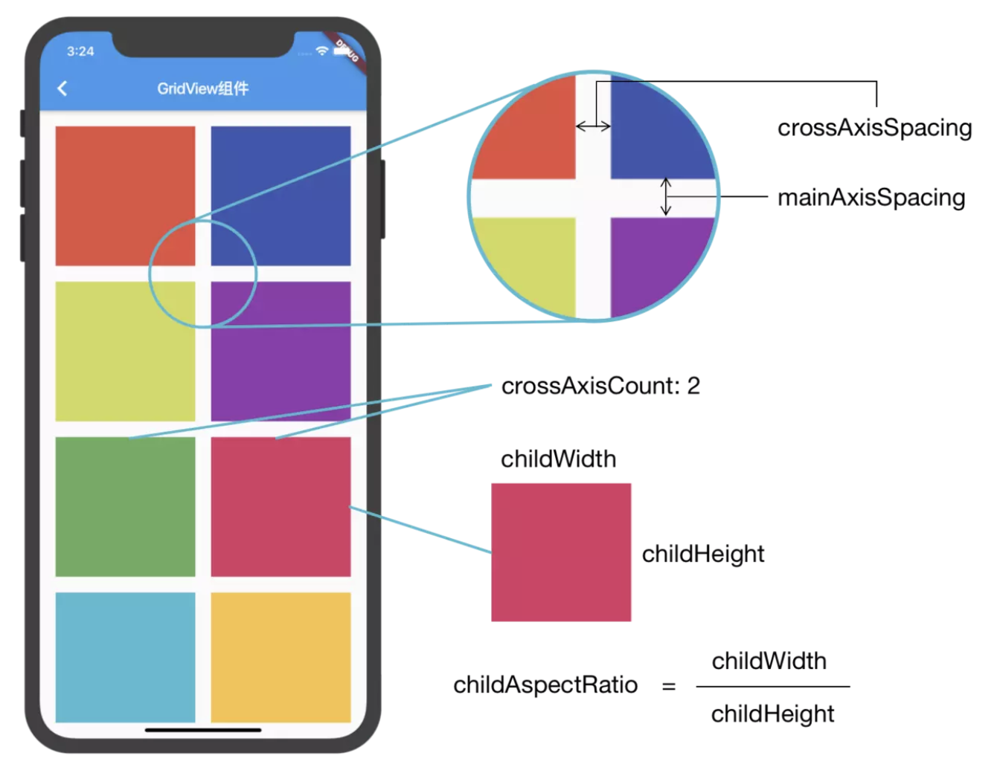

#####SliverGridDelegateWithMaxCrossAxisExtent的参数如下

		SliverGridDelegateWithMaxCrossAxisExtent({
		  @required this.maxCrossAxisExtent,
		  this.mainAxisSpacing = 0.0,
		  this.crossAxisSpacing = 0.0,
		  this.childAspectRatio = 1.0,
		})

除maxCrossAxisExtent外，其他参数跟SliverGridDelegateWithFixedCrossAxisCount一样。

假如手机屏宽375

 * maxCrossAxisExtent值为125时，网格列数将是3。因为125 * 3 = 375，刚好，每一列的宽度就是375/3。
 * maxCrossAxisExtent值为126时，网格列数将是3。因为126 * 3 > 375，显示不下，每一列的宽度将是375/3。
 * maxCrossAxisExtent值为124时，网格列数将是4。因为124 * 3 < 375，仍有多余，每一列的宽度将是375/4。

GridView的构造方法有GridView，GridView.builder，GridView.count，GridView.extent，GridView. custom

1. GridView默认构造函数可以类比于ListView默认构造函数，适用于有限个数子元素的场景，因为GridView组件会一次性全部渲染children中的子元素组件；
2. GridView.builder构造函数可以类比于ListView.builder构造函数，适用于长列表的场景，因为GridView组件会根据子元素是否出现在屏幕内而动态创建销毁，减少内存消耗，更高效渲染；
3. GridView.count构造函数是GrdiView使用SliverGridDelegateWithFixedCrossAxisCount的简写，效果完全一致；
4. GridView.extent构造函数式GridView使用SliverGridDelegateWithMaxCrossAxisExtent的简写，效果完全一致。

